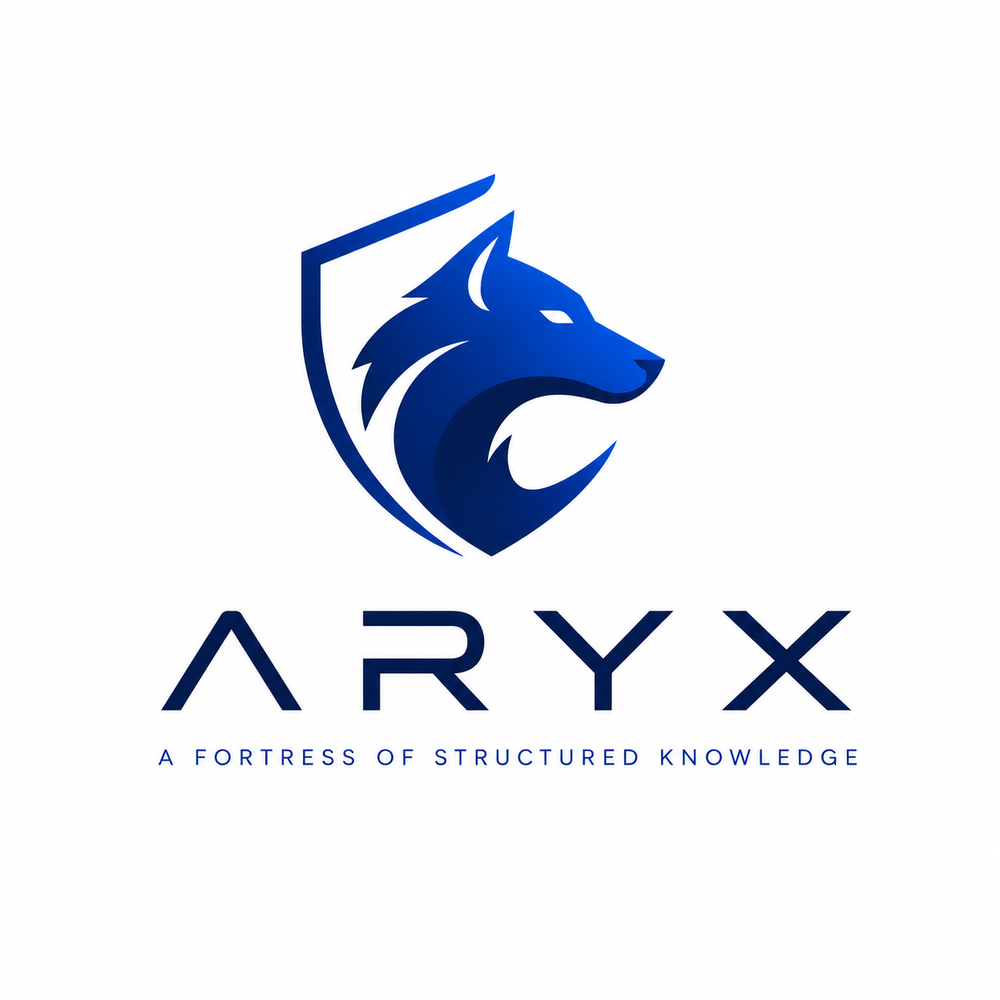

<p align="center">
  
</p>

# Aryx Lite

**Point Aryx at your data. Get a deduplicated, linked knowledge graph you can ask questions of — with provenance on every answer.**

[](https://github.com/giggsoinc/aryx/actions/workflows/ci.yml)
[](LICENSE)
[](https://github.com/FalkorDB/FalkorDB)
[](https://hub.docker.com/r/giggsodocker/aryx-lite)

[Install](docs/INSTALL.md) · [User guide](docs/USER_GUIDE.md) · [Quickstart data](examples/quickstart/) · [Contributing](CONTRIBUTING.md) · [Raven (Claude Code)](docs/RAVEN.md) · [Code of conduct](CODE_OF_CONDUCT.md) · [Licensing](docs/LICENSING.md)

> **Public · source-available (BSL 1.1).** Postgres is the system of record; the live knowledge graph is projected into **[FalkorDB](https://github.com/FalkorDB/FalkorDB)**.

---

## Repository overview

**Aryx** turns the data you already have into a **workspace-scoped knowledge graph** you can ask questions of. You state goals in plain English, connect a database or upload files, approve the model Aryx proposes, resolve duplicates into golden entities, and explore with **Ask**, **Model**, **Data** (tree / table / entity graph), and **Accuracy Lab** — with **provenance** on answers and merges.

| | |
|---|---|
| **Edition in this repo** | **Aryx Lite** — single-team outcome mapping (laptop / small server) |
| **Not (yet)** | Multi-tenant governed enterprise estate (that path is Enterprise / Aryx-o) |
| **SoT / graph** | PostgreSQL truth · FalkorDB rebuildable projection |
| **UI** | Next.js only (`apps/web`) — no Streamlit |
| **Images** | [`giggsodocker/aryx-lite`](https://hub.docker.com/r/giggsodocker/aryx-lite) (API · worker · MCP) · [`aryx-lite-web`](https://hub.docker.com/r/giggsodocker/aryx-lite-web) |
| **Tags** | `latest` · `1.0.0` · `v1.0.0` · git short SHA |
| **License** | BSL 1.1 → GPL-3.0-or-later on 2029-07-15 · [details](docs/LICENSING.md) |
| **Docker Hub overview** | [docs/DOCKERHUB.md](docs/DOCKERHUB.md) |

---

## What it does

| Step | What happens |
|------|----------------|
| **1. Goals** | You describe what you want to figure out in plain English |
| **2. Ingest** | Connect a database or upload files (CSV, PDF, DOCX, …) |
| **3. Resolve** | Duplicates merge into golden entities; weak pairs wait for human review |
| **4. Link** | Cross-file relationships are discovered and projected into a graph |
| **5. Explore** | Ask, Model canvas, Data explorer (tree / table / **entity graph**), Accuracy Lab |

Built for a **single team’s** outcome mapping on a laptop or small server — not yet a multi-tenant governed enterprise estate.

---

## Quick start

**Requirements:** [Docker](https://docs.docker.com/get-docker/) + Docker Compose · ~8 GB RAM recommended (Ollama models)

**Images (Docker Hub):** [`giggsodocker/aryx-lite`](https://hub.docker.com/r/giggsodocker/aryx-lite) (`latest` · `1.0.0` · `v1.0.0`) · [`giggsodocker/aryx-lite-web`](https://hub.docker.com/r/giggsodocker/aryx-lite-web)

```bash
git clone https://github.com/giggsoinc/aryx.git
cd aryx
cp .env.example .env          # edit passwords / LLM keys as needed
docker compose pull           # optional — use Hub images when published
docker compose up -d          # builds locally if pull is empty
```

First boot pulls LLM models into Ollama (can take several minutes).

| Surface | URL |
|---------|-----|
| **Web UI** | http://localhost:3000 |
| **Settings** (LLM provider / API keys) | http://localhost:3000/settings |
| **API docs** | http://localhost:8088/docs |
| **MCP (SSE)** | http://localhost:8765/sse |

Then: open the web UI → **New workspace** → **Onboard** (`/start`) → goals → add a source → run.

**Sample data:** upload the CSVs in [`examples/quickstart/`](examples/quickstart/) (customers + tickets) to exercise multi-file ingest and the entity graph.

Full steps, ports, and troubleshooting: **[docs/INSTALL.md](docs/INSTALL.md)** · UI walkthrough: **[docs/USER_GUIDE.md](docs/USER_GUIDE.md)**

### Smoke check (API)

```bash
curl -s http://localhost:8088/health
# then open http://localhost:3000
```

### Pull a pinned backend image

```bash
docker pull giggsodocker/aryx-lite:1.0.0
# or: docker pull giggsodocker/aryx-lite:latest
```

---

## Product surfaces (Next.js)

| Route | Purpose |
|-------|---------|
| `/start` | Guided onboard wizard |
| `/` | **Ask** — grounded Q&A with citations |
| `/model` | Ontology canvas (types, relationships, survivorship, axioms) |
| `/data` | Transparency explorer — Tree, Table, **interactive entity Graph** |
| `/lab` | Accuracy Lab — ontology ON vs OFF + reasoner check |
| `/settings` | **LLM provider** — Ollama, Anthropic, OpenAI-compatible, Gemini, Grok (xAI) |

There is **no Streamlit UI**. The product UI is Next.js only.

---

## Highlights

- **Multi-source ingest** — Postgres, MySQL, Oracle; files (CSV/JSON/PDF/DOCX/PPTX/images)
- **Discovery-driven ontology** — propose types, human approval gate, RDF/OWL import-export
- **Entity resolution** — multi-key blocking, four-band scoring, HITL review, survivorship policies
- **Cross-file relationships** — deterministic FK discovery after multi-file upload
- **Entity graph** — pan/zoom, search, type filters, click-to-explore neighbors + detail panel
- **Workspace isolation** — LIST-partitioned Postgres; one graph per workspace
- **Local or cloud LLMs** — default Ollama; swap live under Settings (no restart)
- **MCP** — tools over SSE for external agents
- **Ports & adapters** — relational / graph / vector / LLM / reasoner / compute swappable for Enterprise / Aryx-o

---

## Stack

| Layer | Technology |
|-------|------------|
| API | FastAPI + OpenAPI |
| Web | Next.js 15 (App Router, Tailwind) |
| Database (source of truth) | PostgreSQL 16 + pgvector |
| **Graph projection** | **[FalkorDB](https://github.com/FalkorDB/FalkorDB)** (one named graph per workspace) |
| LLM | Ollama (default) · Anthropic · OpenAI-compatible · Gemini · Grok |
| Agents | MCP over SSE |
| Deploy | Docker Compose · [`giggsodocker/aryx-lite`](https://hub.docker.com/r/giggsodocker/aryx-lite) |

Aryx is an application on top of FalkorDB (and Postgres), not a fork of the database.

---

## Documentation

| Doc | Contents |
|-----|----------|
| [Install](docs/INSTALL.md) | Docker, Hub images, env, security, updates, local dev |
| [User guide](docs/USER_GUIDE.md) | Workspaces, onboard, Ask, Data, Model, Lab, Settings |
| [Quickstart data](examples/quickstart/) | Sample CSVs for multi-file upload → graph |
| [Features](docs/FEATURES.md) | Capability matrix |
| [Architecture](docs/ARCHITECTURE.md) | System design |
| [Licensing](docs/LICENSING.md) | BSL plain English |
| [Ingestion](docs/INGESTION_GUIDE.md) | Deep ingest walkthrough |
| [Docker Hub overview](docs/DOCKERHUB.md) | Image description (API / worker / MCP) |
| [Raven](docs/RAVEN.md) | Optional Claude Code workflow (`.claude` + manifest) |
| [Benchmarks](docs/wiki/BENCHMARKS.md) | ER measurements |

Diagrams: [Business view](docs/diagrams/business-view.html) · [Technical flow](docs/diagrams/technical-flow.html)

---

## Community

- [Code of Conduct](CODE_OF_CONDUCT.md)
- [Contributing](CONTRIBUTING.md)
- [Security policy](SECURITY.md)
- [Issues](https://github.com/giggsoinc/aryx/issues) · [Discussions](https://github.com/giggsoinc/aryx/discussions) (if enabled)

---

## License (BSL 1.1)

Source-available under the **Business Source License 1.1**. You may use and modify Aryx Lite for evaluation, research, and internal production under the Additional Use Grant. Competing multi-tenant hosting of this work requires a commercial license until the Change Date (**2029-07-15**), when this version becomes **GPL-3.0-or-later**.

Full text: [`LICENSE`](LICENSE) · Summary: [`docs/LICENSING.md`](docs/LICENSING.md) · Notice: [`NOTICE`](NOTICE)

---

## Who builds it

Maintained by **[Giggso](https://giggso.com)**.
