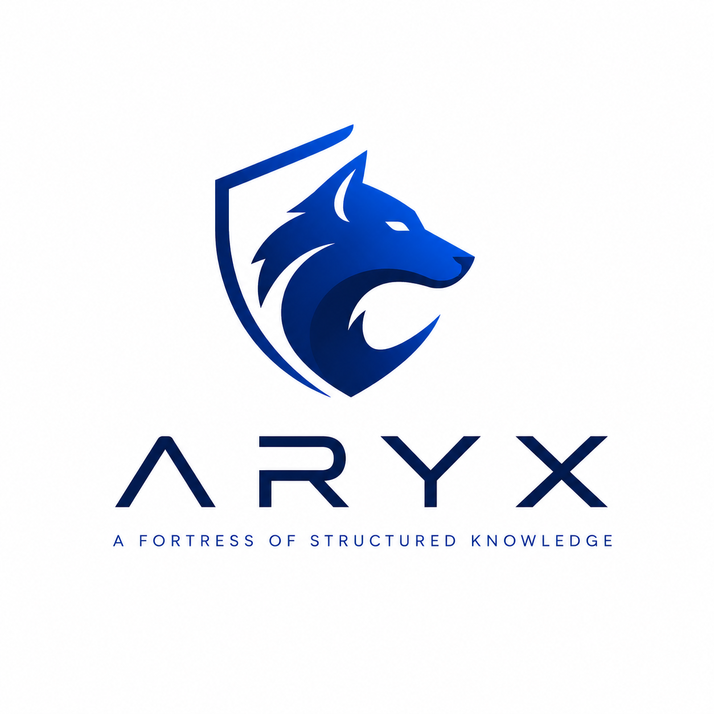
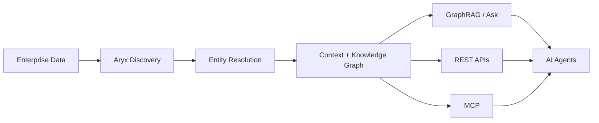

<p align="center">
  
</p>

# Aryx

### Self-Building Context for AI Agents

**The self-building context layer for AI agents.**

Connect your data. Aryx discovers entities, relationships, and business context automatically and turns them into continuously evolving **context graphs** that agents can query and reason over.

`Context Engineering` · `Knowledge Graphs` · `Agent Context` · `Ontology Discovery` · `Entity Resolution` · `GraphRAG` · `MCP` · `Provenance`

```text
Data → Discover → Resolve → Connect → Context Graph → Agents
```

Traditional RAG retrieves documents.  
Aryx connects what databases, applications, APIs, and documents **mean to each other**.

[](https://github.com/giggsoinc/aryx/actions/workflows/ci.yml)
[](LICENSE)
[](https://github.com/FalkorDB/FalkorDB)
[](https://hub.docker.com/r/giggsodocker/aryx-lite)

[Quick start](#quick-start) · [Install](docs/INSTALL.md) · [User guide](docs/USER_GUIDE.md) · [Architecture](docs/ARCHITECTURE.md) · [MCP](docs/mcp-guide.html) · [Docker Hub](docs/DOCKERHUB.md) · [Contributing](CONTRIBUTING.md)

**Usage guides**

| Who | Guide |
|-----|--------|
| **Developers & agent engineers** | [Markdown](docs/guides/DEVELOPER_GUIDE.md) · [HTML](docs/guides/DEVELOPER_GUIDE.html) |
| **Business & leadership** | [Markdown](docs/guides/BUSINESS_GUIDE.md) · [HTML](docs/guides/BUSINESS_GUIDE.html) |

---

## Why Aryx?

AI agents can access more enterprise data than ever. **Access is not understanding.**

Enterprise information is fragmented across databases, SaaS apps, APIs, documents, tickets, email, and ops systems. Each system has its own IDs, names, and shapes for the same real-world things.

Without a shared context layer, every agent re-infers those relationships at runtime—in prompts, brittle glue code, or one-off scripts.

Aryx builds that context once and **extends it as data changes**.

> **Retrieval finds information. Aryx connects meaning.**

---

## Quick start

**Requirements:** [Docker](https://docs.docker.com/get-docker/) + Compose · ~8 GB RAM recommended if you use local Ollama models.

```bash
git clone https://github.com/giggsoinc/aryx.git
cd aryx
cp .env.example .env
docker compose pull
docker compose up -d
```

| Surface | URL |
|---------|-----|
| **Web UI** | http://localhost:3000 |
| **API docs** | http://localhost:8088/docs |
| **MCP (SSE)** | http://localhost:8765/sse |

### First result in minutes

1. Open http://localhost:3000 → **Settings** (optional: set Gemini / OpenAI / Claude / Grok, or keep Ollama).
2. **New workspace** → setup is **data first**: upload sample CSVs from [`examples/quickstart/`](examples/quickstart/) (customers + tickets).
3. **Smart review** drafts a brief + graph plan → **Build**.
4. Open **Data** (entities + provenance), **Model** (types), **Ask** (grounded Q&A with citations).

Smoke check:

```bash
curl -s http://localhost:8088/health
```

Pinned images: `giggsodocker/aryx-lite:1.7.0` · `giggsodocker/aryx-lite-web:1.7.0` — see [DOCKERHUB.md](docs/DOCKERHUB.md).

Full install notes: [docs/INSTALL.md](docs/INSTALL.md).

---

## What Aryx does

Six actions—not a pile of modules:

### 1. Connect

Bring structured and unstructured sources into one discovery pipeline: databases (Postgres, MySQL, Oracle), files (CSV, JSON, PDF, DOCX, slides, images), and REST-style sources.

### 2. Discover

Identify entity types, attributes, relationships, and candidate business meaning from samples and schemas. You approve a plan; you do not hand-draw every class first.

### 3. Resolve

Detect when different rows and systems refer to the **same** customer, product, asset, ticket, or business object—and merge them into golden entities with clear membership.

### 4. Build

Construct a queryable **context / knowledge graph** with **provenance**: every fact can point back to the source record that produced it.

### 5. Evolve

Land new data, re-resolve, and project changes into the graph. Incremental projection keeps the live graph aligned with Postgres as the system of record.

### 6. Serve

Expose grounded context to apps and agents via REST, Ask (graph-grounded answers + citations), and **MCP** tools for hosts such as Claude Desktop.

---

## Enterprise example

A customer lives in Salesforce.  
Their product is in an ERP.  
An incident hits ServiceNow.  
Logs sit in observability.  
Escalation threads are in email.  
The contract is a PDF.

Search and RAG retrieve **pieces**.

Aryx connects a usable path:

```text
Customer → Contract → Product → Installation
       → Incident → Support Case → Engineering Change → Business Impact
```

An agent can reason over **linked business context** instead of re-interpreting six systems on every turn.

---

## Context graph vs RAG

| | RAG | Aryx |
|---|-----|------|
| Core question | “Which documents are relevant?” | “How are these business facts connected?” |
| Unit of work | Chunks / embeddings | Entities, relationships, identity, provenance |
| Typical failure | Right doc, wrong join | Needs sources loaded and resolved |

Aryx **complements** vector search and RAG. Use RAG for narrative recall; use Aryx for **identity, links, and grounded structure** agents can traverse.

---

## Designed for agentic AI

Agents need more than a bigger context window:

| Capability | Why it matters |
|------------|----------------|
| **Persistent context** | Shared workspace graph, not a one-shot prompt |
| **Entity identity** | Same customer across CRM + ERP + tickets |
| **Relationship awareness** | Traversable links, not flat text blobs |
| **Provenance** | Answers cite source records |
| **Graph traversal** | Multi-hop business questions |
| **Grounded Ask** | LLM answers constrained by graph + sources |
| **Incremental updates** | New ingest extends context |
| **Machine interfaces** | HTTP APIs + MCP for agent hosts |

That reduces how much business understanding must be rebuilt inside every prompt or agent chain.

---

## Architecture


```mermaid
flowchart LR
    A[Enterprise Data] --> B[Aryx Discovery]
    B --> C[Entity Resolution]
    C --> D[Context + Knowledge Graph]
    D --> E[GraphRAG / Ask]
    D --> F[REST APIs]
    D --> G[MCP]
    E --> H[AI Agents]
    F --> H
    G --> H
```

**Implementation facts (this repo):**

- **Postgres** — system of record for landed records, entities, jobs, workspaces  
- **FalkorDB** — rebuildable graph projection (one named graph per workspace)  
- **Next.js UI** — Home, setup, Data, Model, Lab, Ask, Observe, Settings  
- **FastAPI** — ingest, resolve, project, Ask, admin  
- **LLMs** — Ollama (default) or cloud providers via Settings (Gemini, OpenAI, Anthropic, Grok, …)

Deeper design: [docs/ARCHITECTURE.md](docs/ARCHITECTURE.md).

---

## Core capabilities

- **Automatic context discovery** — structure is proposed from data (and optional brief), not only from a hand-built schema  
- **Identity across sources** — multi-key blocking, scoring, optional LLM adjudication, HITL queue  
- **Continuously extendable graphs** — re-ingest, dimension links, cross-file FK discovery, incremental projection  
- **Provenance by design** — entities carry membership to source records  
- **Built for agent consumption** — Ask with citations; MCP tool surface; not “pretty graph only”  
- **Human-in-the-loop** — smart review on setup, Model canvas, Correct data coach, adjudication questions  

---

## Integrations

| Kind | Support in this repo |
|------|----------------------|
| Databases | Postgres, MySQL/MariaDB, Oracle (SQL connector path) |
| Files | CSV, JSON, PDF, DOCX, PPTX, images |
| LLMs | Ollama · Anthropic · OpenAI-compatible · Gemini · Grok |
| Graph store | FalkorDB |
| Agent protocol | MCP over SSE (`:8765`) |
| Ontology interchange | RDF/OWL import-export (see [RDF guide](docs/RDF_EXPORT_GUIDE.md)) |

---

## API / MCP / query

**HTTP** — OpenAPI at http://localhost:8088/docs after compose is up.

**Ask (conceptually):** grounded natural-language questions over the workspace graph with cited entities/sources.

**MCP** — point an MCP host at `http://localhost:8765/sse` (see [docs/mcp-guide.html](docs/mcp-guide.html)). Tools cover workspaces, ingest status, and ask-style flows so agents can operate Aryx without only using the UI.

**Sample data** — [`examples/quickstart/`](examples/quickstart/) multi-file customer + ticket CSVs exercise discovery, resolution, and linking.

---

## What makes Aryx different

| | |
|--|--|
| **Automatic context discovery** | Semantic structure is discovered from data; you approve and refine. |
| **Identity across systems** | Fragmented representations of the same real-world entity become one golden record. |
| **Evolving graphs** | New data extends and reprojects context; not a one-time diagram. |
| **Provenance** | Facts stay traceable to source systems and records. |
| **Agent-ready** | Graph is operational context for apps and AI agents, not only analytics viz. |
| **Honest data plane** | Records are **landed** into Postgres for resolution and audit. The graph is a **projection**. This is not a claim of zero-copy live federation of every SaaS API. |

Aryx is **not** “just” a graph database, ontology IDE, vector DB, RAG framework, data catalog, or API gateway.

Those store, search, describe, or move information.  
**Aryx builds the connected context agents need to understand the business.**

---

## Editions

This repository is the public **Aryx** product line (shipped as the self-hostable stack often labeled *Lite* in package tags).

| | This repo | Enterprise (commercial fork) |
|--|-----------|------------------------------|
| **Focus** | Self-building context for teams: connect → discover → resolve → serve agents | Scale, governance, agentic multi-agent planning control plane |
| **License** | BSL 1.1 → GPL-3.0-or-later on 2029-07-15 | Commercial EULA |
| **Stack default** | Postgres · FalkorDB · Ollama / cloud LLMs | Same engine idea; substrate + ops adapters |

Details: [docs/EDITIONS.md](docs/EDITIONS.md) · [docs/LICENSING.md](docs/LICENSING.md).

---

## Documentation

| Doc | Purpose |
|-----|---------|
| [**Developer guide**](docs/guides/DEVELOPER_GUIDE.md) ([HTML](docs/guides/DEVELOPER_GUIDE.html)) | Engineers & agent builders — why Lite, start, use by role |
| [**Business guide**](docs/guides/BUSINESS_GUIDE.md) ([HTML](docs/guides/BUSINESS_GUIDE.html)) | Sponsors & ops — outcomes, pilot path, stakeholder use |
| [INSTALL.md](docs/INSTALL.md) | Compose, ports, env, troubleshooting |
| [USER_GUIDE.md](docs/USER_GUIDE.md) | UI walkthrough (setup, Data, Model, Ask) |
| [ARCHITECTURE.md](docs/ARCHITECTURE.md) | System design, ports & adapters |
| [FEATURES.md](docs/FEATURES.md) | Capability matrix |
| [INGESTION_GUIDE.md](docs/INGESTION_GUIDE.md) | Pipeline stages |
| [UI_BUSINESS_FLOW.html](docs/UI_BUSINESS_FLOW.html) | Product path (HTML) |
| [DOCKERHUB.md](docs/DOCKERHUB.md) | Image names and tags |
| [mcp-guide.html](docs/mcp-guide.html) | MCP host setup |

---

## Contributing

See [CONTRIBUTING.md](CONTRIBUTING.md) and [CODE_OF_CONDUCT.md](CODE_OF_CONDUCT.md).  
CI runs on `main`. Prefer focused PRs with tests where behavior changes.

---

## Community

- Issues: [github.com/giggsoinc/aryx/issues](https://github.com/giggsoinc/aryx/issues)  
- Commercial / Enterprise: **support@giggso.com**  
- Claude Code discipline tooling in-tree: [docs/RAVEN.md](docs/RAVEN.md)

---

## License

**Business Source License 1.1** — source-available. Internal production use is allowed under the Additional Use Grant. Competing multi-tenant hosting of this work requires a commercial license until the Change Date (**2029-07-15**), when this version becomes **GPL-3.0-or-later**.

Full terms: [LICENSE](LICENSE) · plain English: [docs/LICENSING.md](docs/LICENSING.md).

---

**Mental model:** enterprise systems contain data. Aryx discovers how that data connects, continuously builds business context, and makes that context usable by AI agents.
