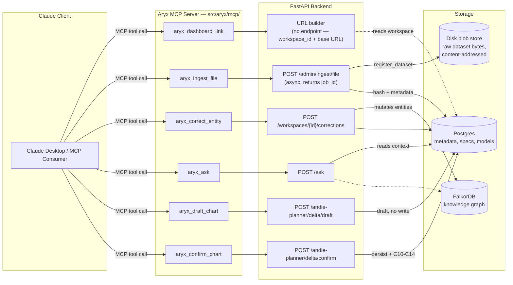

# Plan — MCP Tools for Dashboard Link, Ingestion, Correction, Ask, Ask-to-Visualize

Andie session — 🎭 Drama mode — 2026-08-14
Panel: Meera (API/Integration Product Lead) · Martin (MCP Server Architect) · Ravi (Data Pipeline & Graph Integration Lead)

Status: **implemented** (2026-08-14) in `src/aryx/mcp/` — see "Implementation Notes" at the end for the two places the shipped code deviated from this plan, both discovered during implementation by reading the actual existing MCP dispatch code before writing anything new.

---

## Context

The latest dashboard pipeline (C01–C15, merged to `main` via PR #39) has no MCP surface of its own — `src/aryx/mcp/` already exposes ontology, ingest-HITL, datasource, and onboarding tools, but nothing for the newer dashboard-facing capabilities. The ask: expose five capabilities to an external Claude client (Claude Desktop or any other MCP consumer) —

1. The dashboard link for a workspace
2. Dataset ingestion
3. Knowledge-graph entity correction (the human-correction loop)
4. Ask (natural-language query)
5. Ask-to-visualize (draft + confirm a new chart against an approved spec)

All five map to **existing backend code** — this is an MCP wrapping exercise, not new product logic.

---

## Capability → Endpoint Mapping

| Capability | Backend | Notes |
|---|---|---|
| Dashboard link | *(none — frontend route only)* | `/dashboard` is a Next.js page keyed by `workspace_id`; no API returns a link today |
| Ingestion | `POST /admin/ingest/file` (`file_ingest_api.py`) | Single call site for `register_dataset` (`file_ingest_api.py:96`) |
| Graph correction | `POST /workspaces/{workspace_id}/corrections` (`corrections_api.py`) | Mutates graph entities directly |
| Ask | `POST /ask` (`ask_api.py`) | Synchronous |
| Ask-to-visualize | `POST /andie-planner/delta/draft` + `POST /andie-planner/delta/confirm` (`andie_planner_api.py`) | Two-step by design — draft then human-confirm |

---

## Decision: 6 tools, not 5

### Why ask-to-visualize is two tools
`delta/draft` and `delta/confirm` are separate backend calls on purpose — draft proposes a chart against an already-approved spec, confirm is the human-in-the-loop gate that actually persists it (triggering C10→C14 downstream). Collapsing them into one MCP tool would remove that confirm gate, which defeats the point of the feature. **Rejected**: a single `aryx_visualize` tool that drafts and auto-confirms.

### Why the dashboard link needs a `workspace_id` input, not a static answer
Nothing else in this plan defaults to a single workspace, and hardcoding one would silently break for every other workspace. The tool constructs `{base_url}/dashboard?workspace_id={id}` — it is not a passthrough to any backend endpoint, since none exists.

### Tool spec

| MCP tool | Wraps | Behavior notes |
|---|---|---|
| `aryx_dashboard_link` | *(URL builder)* | Input: `workspace_id`. Output: a URL string. No backend call. |
| `aryx_ingest_file` | `POST /admin/ingest/file` | **Async** — returns `job_id` immediately; ingestion runs as a background job. See "Ingestion has changed" below. |
| `aryx_correct_entity` | `POST /workspaces/{id}/corrections` | Mutates the knowledge graph. Tool description must say so explicitly — see Auth & Safety. |
| `aryx_ask` | `POST /ask` | Synchronous; returns an answer. |
| `aryx_draft_chart` | `POST /andie-planner/delta/draft` | Step 1 of 2 — proposes a chart, does not persist. |
| `aryx_confirm_chart` | `POST /andie-planner/delta/confirm` | Step 2 — persists the chart; triggers downstream C10–C14. |

---

## Ingestion has changed since the last time this was documented

`register_dataset`'s storage backend changed in this same review cycle (PR #39, blocker #5): raw dataset bytes no longer land in a Postgres `BYTEA` column. They now go to a content-addressed disk blob store (`aryx.store.blob_store`), keyed by the SHA-256 hash already computed at ingest. Postgres keeps only the hash and metadata (`raw_snapshot_ref` is now the real blob key, not the old fabricated `raw/{dataset_id}/{version}` placeholder).

**Why this matters for the MCP tool**: `aryx_ingest_file`'s description and any response-shape documentation must reflect the *current* behavior, not the pre-fix one. Specifically:
- The tool is async — it returns a `job_id`, never the ingested result directly. A client should not expect to inspect `raw_snapshot_ref` from the tool call's own response; it has to poll job status or query the dataset afterward.
- `raw_snapshot_ref` is a bare hex digest (the blob key), not a path — don't document it as a filesystem path.

---

## Auth & Safety

**Decision**: require `ARYX_API_AUTH=required` in this MCP deployment's own configuration/docs. This is a **documentation/config decision, not a code change** — it does not touch `mcp_mount.py`'s `ARYX_MCP_AUTH_OPTIONAL` fail-open default, which is a separate, already-flagged, product-wide gap (PR #39 review, item #11: "reviewer's own instruction — don't fix here, just don't make it worse").

**Why this is the right scope**: adding `aryx_ingest_file` and `aryx_correct_entity` — both mutating — to the MCP surface raises the stakes on that pre-existing fail-open default. Requiring auth for *this* deployment closes the newly-introduced risk without silently expanding into the broader IDOR fix (PR #39 review, item #3), which remains its own dedicated, cross-cutting piece of work.

**Tool description wording** (the actual safety mechanism, since MCP clients surface tool descriptions before invocation):
- `aryx_correct_entity`: must read as "this changes graph data" — not a generic action verb.
- `aryx_confirm_chart`: must read as "this persists a new chart to the dashboard" — distinct from `aryx_draft_chart`'s non-persisting nature.

---

## Architecture

Red-equivalent (mutating/graph-changing): `aryx_correct_entity` / `POST /corrections`.
Amber-equivalent (async, blob-store-affected): `aryx_ingest_file` / `POST /admin/ingest/file`.

---

## Implementation Handoff

Suggested file layout, consistent with the existing `src/aryx/mcp/` module-per-domain pattern (`tools_ontology.py`, `tools_ingest.py`, `tools_datasource.py`):

- New `src/aryx/mcp/tools_dashboard.py` — `aryx_dashboard_link`
- New `src/aryx/mcp/tools_ask.py` — `aryx_ask`, `aryx_draft_chart`, `aryx_confirm_chart`
- Extend existing ingestion/correction tool modules (or add `tools_dataset.py` / `tools_corrections.py` if none fit) for `aryx_ingest_file`, `aryx_correct_entity`
- Register all six in `src/aryx/mcp/tools.py`'s `tool_specs()` aggregation, matching the existing `_read_act_specs()`-style pattern

Not yet decided (left for the implementer): exact JSON schemas for each tool's input/output — this plan fixes tool boundaries and behavior, not wire format.

---

## Implementation Notes (post-hoc — what actually shipped)

Reading the real MCP dispatch code (`src/aryx/mcp/server.py`, `tools.py`, and every existing `tools_*.py`/dispatch-module pair) before writing anything surfaced two things this plan got wrong or left underspecified:

1. **`ask` already existed.** It's registered in `tools.py`'s `_read_act_specs()` and dispatched straight to `POST /ask` in `server.py`. Shipped as-is, untouched — 5 new tools, not 6 as counted here, since this plan's capability table double-counted it.

2. **Correction became two tools, not one.** `POST /admin/workspaces/{id}/corrections` applies immediately with no confirmation step — fine for a human clicking a UI button, but wrapping it as a single agent-callable MCP tool would contradict the trust posture already established for `act` (`aryx.mcp.act`): "agent-initiated mutations ALWAYS create a pending execution for human approval... regardless of the action's approval flag." The existing `corrections_api.py` already has a matching two-step shape for its chat surface (`/corrections/chat` proposes, `/corrections` applies) that was never wired into MCP — reused it instead of inventing a new one. Shipped as `correction_propose` (wraps `/corrections/chat`, never mutates) + `correction_apply` (wraps `/corrections`, mutates immediately) — same two-call pattern as `chart_draft`/`chart_confirm`.

Final shipped surface — 6 new tools (5 genuinely new + `ingest_file` extending the existing `ingest_*` family), all in `src/aryx/mcp/`:

| Tool | Module (spec / dispatch) |
|---|---|
| `dashboard_link` | `tools_dashboard.py` / `dashboard.py` |
| `ingest_file` | `tools_ingest.py` (extended) / `ingest_hitl.py` (extended, +multipart helper) |
| `correction_propose`, `correction_apply` | `tools_correction.py` / `correction.py` |
| `chart_draft`, `chart_confirm` | `tools_chart.py` / `chart.py` |

`server.py`'s `_get`/`_post`/`_ws`/`_enrich_workspace` helpers (previously inline) were extracted to a new `read.py` alongside this change — `server.py` had grown to 159 lines wiring in the new dispatch branches, over the 150-line style cap; `read.py` now owns the original `list`/`ask` tool logic and server.py dropped to 75 lines.

Tests: `tests/test_mcp_dashboard.py`, `test_mcp_correction.py`, `test_mcp_chart.py`, `test_mcp_ingest_file.py`, `test_mcp_tools_aggregate.py` (27 tools total, no name collisions) — plus a pre-existing `tests/test_ingest_hitl_specs.py` updated from its old hardcoded "4 tools" assertion to 5. Full suite: 1,346 tests passing.

Frontend catalog `apps/web/lib/mcpTools.ts` and `docs/guides/MCP_QUICKSTART.md` updated to match (21 → 27 tools; "Ingest HITL" group renamed to "Ingest" since it's no longer HITL-only).

Auth stance from this plan (require `ARYX_API_AUTH=required` for deployments exposing these tools) is a deployment/config decision, not code — no `mcp_mount.py` change was made, matching the original scope boundary against the still-open IDOR item.
