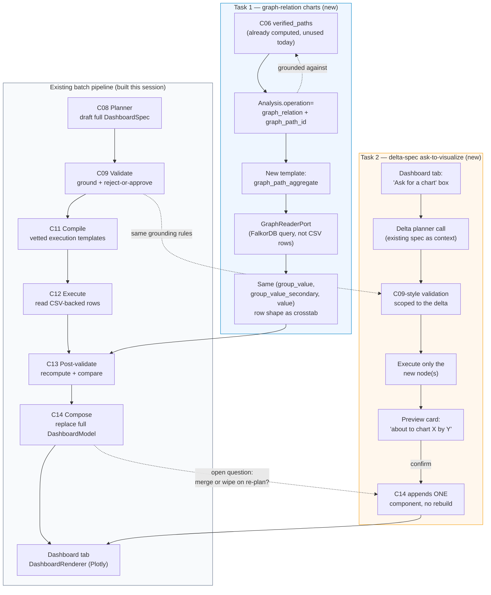

# Plan — Graph-Driven Charts (Task 1) & Delta-Spec Ask-to-Visualize (Task 2)

Andie session — 🎭 Drama mode — 2026-08-05
Panel: Meera (Dashboard Product Lead) · Kenji (Pipeline Architecture Lead) · Aisha (Knowledge Graph & Ontology Lead) · Ravi (Anarchist) · Fatima (Saboteur)

Status: **plans accepted, not yet implemented.** This document is the handoff artifact for whichever specialist/skill picks up implementation next.

---

## Context

This builds on the chart-type expansion already shipped this session (see `docs/chart_type_expansion_report.md`): new operations (`crosstab`, `row_points`, `date_span`, `survival`, `histogram`), a Plotly-based frontend renderer, and the full C08→C14 planning/validation/execution/composition pipeline now producing real chart variety instead of bar-everywhere.

Two follow-on requests triggered this session:
1. Reproduce the reference dashboard (`Visualization.py` / `index.html`, 29 Plotly charts) *dynamically* per dataset/workspace, using the knowledge graph to drive non-rudimentary "hidden insight" charts.
2. Let a customer ask for a specific chart (in the ask tab or dashboard tab) and have it appear in the dashboard.

---

## Task 1 — Graph-Driven Cross-Entity Charts

### Decision
Two chart families, not a literal "2D dataset / 3D graph" split:
- **Same-dataset** charts (bar, line, box, histogram, scatter, and crosstab-derived sankey/treemap/heatmap) — unchanged, already shipped. Crosstab already proves these don't need a graph.
- **Cross-entity** charts (new) — gated strictly on a real, already-verified graph path (C06 `verified_paths`). Never fabricated. This is the actual "hidden insight" differentiator: joining entities across datasets that a flat table can't reach.

### Why this framing (rejected alternatives)
- ❌ Literal "2D = dataset, 3D = graph" — false axis; sankey/treemap are already proven derivable from flat crosstab data with no graph involved.
- ❌ "Depth" as a first-class planning concept — real idea, but new machinery beyond scope for this phase.
- ✅ Same-dataset vs. cross-entity is the axis that actually matches what the graph uniquely provides: joins the CSV can't express.

### Design

| Layer | Change |
|---|---|
| **C08 models** (`andie_planner/models.py`) | `Analysis` gains `graph_path_id: str \| None`; new `operation="graph_relation"` value. |
| **C08 grounding** (`ground.py`) | `graph_path_id` must be in `approved_graph_paths` (already a real `PlanningContext` field — today it's surfaced but never consumed downstream; this closes that loop). Invalid/missing path → drop, warn, never invent. |
| **C08 prompt** (`prompt.py`) | Chart guide gains one rule: relationship across entities (not columns in one dataset) → cite a real `approved_graph_paths` id, `graph_relation` operation, chart_type sankey/treemap/network. |
| **C09 validation** (`checks.py`) | New structural rule in `check_chart_axis_compatibility`: `sankey`/`treemap`/`network` sourced from a `graph_relation` analysis require operation match + real `graph_path_id` — same pattern as this session's `crosstab`/`date_span` rules. |
| **C11 compiler** (`execution_compiler/`) | New template `graph_path_aggregate`. Unlike every existing template, it does **not** read CSV-backed rows. |
| **C12 execution** (`analysis_execution/`) | New execute.py branch: queries `GraphReaderPort` (existing port/adapter, FalkorDB-backed) to traverse the verified path and aggregate — MVP is **count of end-entities per start-entity only** (sum/average-along-a-path deferred). Output shape: identical `(group_value, group_value_secondary, value)` rows crosstab already produces. |
| **Frontend** | **No changes.** `buildSankeySpec`/`buildTreemapSpec`/`buildHeatmapMatrixSpec` already consume this exact row shape. |
| **Fallback** | Workspace with no rich/verified graph → planner simply never proposes `graph_relation` (nothing in `approved_graph_paths` to cite). No empty section, no placeholder, no fabricated chart. |

### Open questions (not yet resolved)
- [ ] **Does `GraphReaderPort` support the traversal query this needs, or does it need a new method?** Flagged as a technical spike before implementation starts.
- [ ] Path→attribute resolution for a future sum/average-along-a-path (post-MVP): which property at the path's end is the aggregated value?

### Risks
- Fresh CSV uploads typically get a thin, auto-inferred graph (mostly 1-hop) — cross-entity section will often be empty early on. Expected, not a bug.
- If the underlying ontology/graph is wrong (bad inferred relationship), a technically-grounded chart can still be substantively wrong — this is an upstream C05/C06 risk this plan does not fix, only inherits.

### Owners
Kenji — pipeline wiring (C06→C08→C11→C12) · Aisha — verified-path quality gate.

---

## Task 2 — Delta-Spec Ask-to-Visualize

### Decision
A new **delta-spec** mode — one request (natural language or picker) triggers one small draft→ground→validate→compile→execute→compose cycle that **appends** to the existing dashboard, rather than a full re-plan. Entered via a dedicated "ask for a chart" box **inside the dashboard tab**, not the general `/ask` endpoint. Ship a picker-based v0 first (proves the append plumbing), NL layer second.

### Why this framing (rejected alternatives)
- ❌ Full re-plan per request — risks reshuffling/dropping charts the customer already has; slow; unpredictable.
- ❌ Overload `/ask` with intent classification ("is this a question or a chart request?") — solves a problem a dedicated dashboard-tab box doesn't have.
- ❌ Dropdown/picker as the *permanent* answer — it can only re-arrange combinations that already exist as a drafted Analysis; it cannot express a genuinely new combination (e.g. "deal size by product family as a box plot" if that Analysis was never drafted). Real limitation, not a shortcut — demoted to a v0 stepping stone, not the end state.

### Design

| Layer | Change |
|---|---|
| **New prompt variant** | Existing spec's approved KPIs/Analyses as context + one NL request → drafts **at most one** new Visualization, plus at most one new Analysis/KPI if the request needs a combination that doesn't exist yet. Much smaller schema than the full `DashboardSpec` JSON. |
| **C09 validation** | Reuses every existing check, scoped to just the delta — no new validation *rules*, just a narrower blast radius. |
| **C11/C12** | Compile and execute only the new node(s) — not the whole plan. Cheaper, faster, and doesn't touch already-computed results. |
| **C14 composition** | New "append one component" path — adds to the existing `DashboardModel`/section, does not rebuild. |
| **Frontend** | New "Ask for a chart" input in the dashboard tab → **preview card** ("about to chart X by Y as Z") → user confirms → component appears. The preview is the actual mitigation for the one real risk this mode has (see below) — cheap, UX-level, not a pipeline change. |
| **v0 (ship first)** | Picker over existing KPIs × compatible chart types, using the same axis-compatibility rules already in C09 — proves steps 2–4 (delta validate/execute/compose) work before the NL layer is added on top. |

### The one real risk specific to this mode
Grounding proves a request's columns/chart-type are **real**; it does not prove the drafted chart answers what the customer actually **asked**. A batch spec with 6–10 charts dilutes one slightly-off item; a single ad hoc request has one chance, and wrong is glaring. Mitigated by the preview/confirm step — not solved structurally, and shouldn't be oversold as solved.

### Open questions (not yet resolved)
- [ ] **Do delta-spec additions survive a later full batch re-plan, or get silently wiped when the whole spec is regenerated?** Needs an explicit merge-or-replace decision before Task 2 ships — not decided in this session.
- [ ] Cap enforcement: what happens if a request genuinely needs *two* new KPIs/Analyses, not one?

### Risks
- Delta additions drifting out of sync with (or being destroyed by) a subsequent full re-plan — see open question above.
- "At most one new KPI/Analysis" is an assumption, not a proven-sufficient constraint.

### Owners
Kenji — delta pipeline · Meera — ask UX + preview card · Aisha — grounding reuse.

---

## Shared architecture (both tasks build on the same spine)

---

## Handoff

- **Decisions accepted:** both plans above (Task 1: same-dataset vs. cross-entity split; Task 2: delta-spec mode via dashboard-tab ask box, picker v0 before NL).
- **Constraints:** no fabricated charts ever (both tasks inherit this session's "no invention" discipline); Task 1 MVP is count-only aggregation; Task 2 v0 ships before NL.
- **Open questions to resolve before/during implementation:** (1) `GraphReaderPort` traversal capability — needs a spike; (2) delta-spec merge-vs-replace behavior on a later full re-plan.
- **Recommended next step:** pick one task to detail into a file-level implementation plan (models, exact templates, exact test additions) — same rigor as this session's chart-type expansion work — before writing code.
